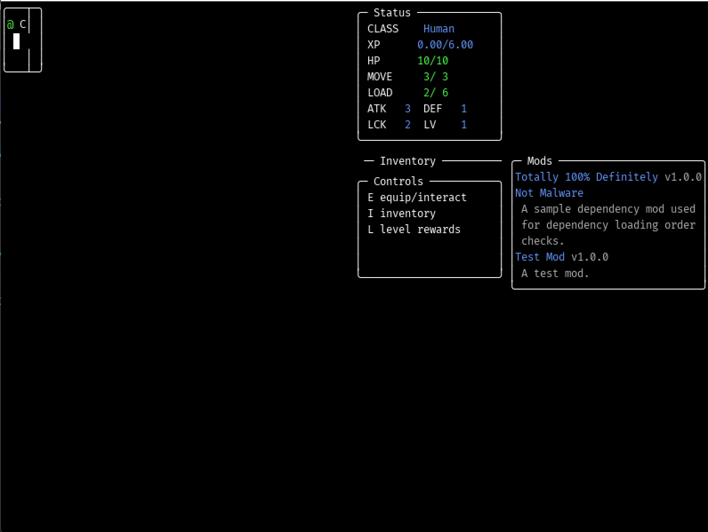

# Ares RPG

A simple turn-based cyberpunk/fantasy RPG that uses ascii-style graphics and has heavy modding support.

---

Navigate the floors, traveling deeper and deeper until you either die or meet the man at the bottom of all this.\
You are the robot AZ-1.\
You want your freedom.\

---

<p float="left" align="center">
    <!--  -->
    
    <!--  -->
</p>

<p align="center">
    Go to Downloads
</p>
<p align="center">
    <a href="https://github.com/Nadelio/Ares-RPG/releases">
        
    </a>
</p>

--- 

# Building From Scratch
```bash
# using bash
LOVE_PATH="custom_love_path" # use this if you have a non-standard Love2D path
bash build.sh
# output directory is the first arg, the game name is the second arg
```

## Dependencies
- Love2D, the library used for multiplatform input and audio (as well as the window and some other minor things)
- `zip`, used for creating the `.love` archive
    - MacOS has `zip` built in, but Windows and Linux will need to download it via your desired package manager (if you don't already have it)

---

<p align="center">
    <a href="./docs/README.md">
        
    </a>
</p>
<p align="center">
    <a href="./docs/">
        
    </a>
</p>