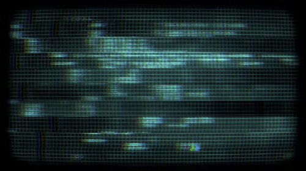
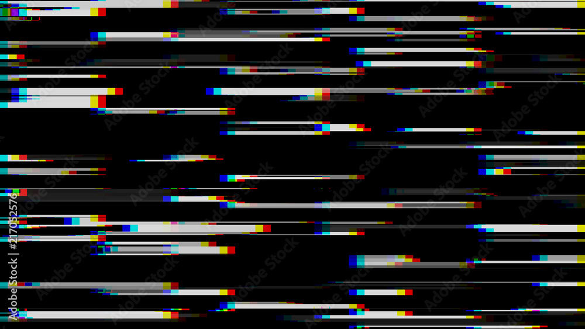

- Intro sequence
    - Random characters that then stabilize into the start menu
Kinda like these ideas:

```
frame 1:
a$*d#─@!-/[\0
?           2
\           f
|           d
@           t
#`Rj:,/g$5^v98
frame 2:
╭#──$───D──v╮
\           s
+           d
│           │
=           y
-──0───)──&─╯
frame 3:
╭───────────╮
│ ARES.EXE  │ // and like these all get typed out 1 by 1 to give a "retro" feel to it
│ > Start   │
│ Settings  │
│ Quit      │
╰───────────╯
```

- Start menu has a scanline bug that uses the `═─▀▁▂▃▄▅▆▇█▉` characters
Kinda like these ideas:



```
frame 1:
╭───────────╮
│           │
▅▅▅▅▅▅▅▅
│           │
─────────────
╰───────────╯

frame 2:
╭───────────╮
▅▅▅▅▅▅▅▅
│           │
─────────────
▀▀▀▀▀▀▀▀▀▀▀▀▀
╰───────────╯

frame 3:
╭───────────╮
▀▀▀▀▀▀▀▀▀▀▀▀▀
│           │
═════════════
│           │
╰───────────╯
```