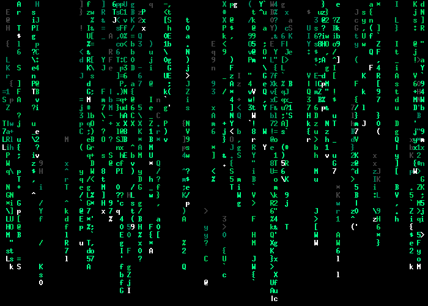

- Intro sequence
    - Random characters that then stabilize into the start menu
Kinda like these ideas:

```
frame 1:
a$*d#─@!-/[\0
?           2
\           f
|           d
@           t
#`Rj:,/g$5^v98
frame 2:
╭#──$───D──v╮
\           s
+           d
│           │
=           y
-──0───)──&─╯
frame 3:
╭───────────╮
│ ARES.EXE  │ // and like these all get typed out 1 by 1 to give a "retro" feel to it
│ > Start   │
│ Settings  │
│ Quit      │
╰───────────╯
```

- Start menu has a scanline bug that uses the `═─▀▁▂▃▄▅▆▇█▉` characters
Kinda like these ideas:


```
frame 1:
╭───────────╮
│           │
▅▅▅▅▅▅▅▅
│           │
─────────────
╰───────────╯

frame 2:
╭───────────╮
▅▅▅▅▅▅▅▅
│           │
─────────────
▀▀▀▀▀▀▀▀▀▀▀▀▀
╰───────────╯

frame 3:
╭───────────╮
▀▀▀▀▀▀▀▀▀▀▀▀▀
│           │
═════════════
│           │
╰───────────╯
```

---

Notification system?
Basically just a small pop-up system that animates a small box in the top-left or top-right coming into frame and staying for a couple of seconds (or until the player closes it)
Some notifications could stay until the player closes it or something with the game closes it (like an interaction no longer being available, so the interaction hint notification disappears)

---

Achievements?
- Need achievement events
    - `revoke_achievement`, when a player does an action that locks them out of an achievement's requirement(s)
    - `bestow_achievement`, when a player completes an achievement's requirement(s)
- Need achievement menu (sub-menu in main menu?)
    - List requirement(s) for most achievements (some are hidden until the player unlocks them)
- Achievement notification (that can be toggled on/off)

---

Tutorial level?
- Simple "floor" that shows the basics of combat, level-ups, movement, and interactions

Tooltips/Hints?
- Optional pop-ups (top-right or top-left corner), that tell you how to do something (control hints, interaction hints, combat hints, level-up notifications, etc)
- Can be configured in the settings (show/hide certain hints or notifications)

---

Floor-based runs?
- Similar to cogmind, objective is to go further up/down the floors, collecting better loot and leveling up, defeating harder and harder enemies and bosses
- Final floor is a big boss fight?
- On death, show various statistics about the run (final floor, final player stats, enemies killed, etc.)
- On death, and after beating the final floor, show a score which is calculated based on # of enemies killed, quality of loot, floor reached, and highest level achieved
    - Gambler and other challenge subclasses will have a "challenge" bonus to the score

---

Classes and Subclasses:
- Warrior
    - Paladin
        - High defense, middle health and luck, low mobility
        - Focus on small amounts of healing and buffs
    - Knight
        - High defense and health, low mobility and luck
    - Barbarian
        - Low defense, high health and damage, high mobility, middle luck 
- Wizard
    - Low defense and health, middle mobility, high luck
    - Druid
        - Healing spells, map altering spells
    - Necromancer
        - Summoning spells, trap spells, curses
    - Warlock
        - "High risk, high reward" spells, curses
- Ranger
    - Middle damage, health, defense, and mobility, low luck
    - Hunter
        - Advantage against animal enemies
    - Marksman
        - Long-range weapon advantages, typically high damage, low defense and mobility
    - Trapper
        - Traps
- Rogue
    - High stealth and damage, low health and defense
    - Assassin
        - Very high single-target damage
    - Spy
        - Disguises
- Specialist
    - Low defense and damage, middle health, mobility, and luck 
    - Engineer
        - Traps, Turrets, Buildings, Disarm Trap skill (can see traps in a 1 tile radius, can interact with traps to disarm them), Spotter mastery skill (trap-sight radius increased to 4 tile radius)
    - Doctor
        - Passive regen, advantage on healing skills, Tend Wounds skill (consume `Bandages` item to regain 1/4 of max health), Revive mastery skill (can revive once a level, starting at the level this skill is unlocked), higher chance to find healing items
    - Gambler
        - High luck, attacks are chance-based ("high risk, high reward"), high single-target damage, AoE attacks have higher chance to fail, if an attack fails, take some damage
        - Health and luck are the only available stats to increase on level-up
        - Harder enemies, but better loot

Some classes have custom stats, like the Rogue has the `stealth` stat, that helps decide whether or not an enemy will target the player
All classes have a weapon-type advantage that is unlocked when the player chooses a subclass
Some classes gain extra enemy-type advantages/disadvantages when the player chooses a subclass

The Specialist class doesn't have any skills until level 5, when the player chooses a subclass.

---

Traps and map-altering spells will change the map temporarily.\
Traps will be invisible to every entity but the one who placed it.\
Map-altering spells may also be traps (like a Druid's vine trap spell)\
Map-altering spells can:
- unlock doors
- temporarily add/remove walls
- create illusions (like fake entities or objects)
- reveal traps/break illusions
- create traps